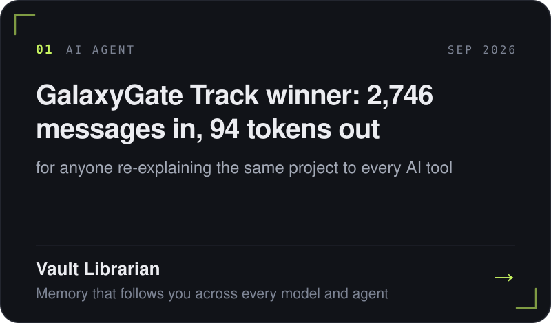
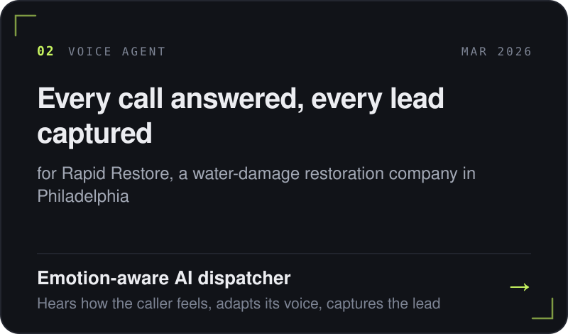
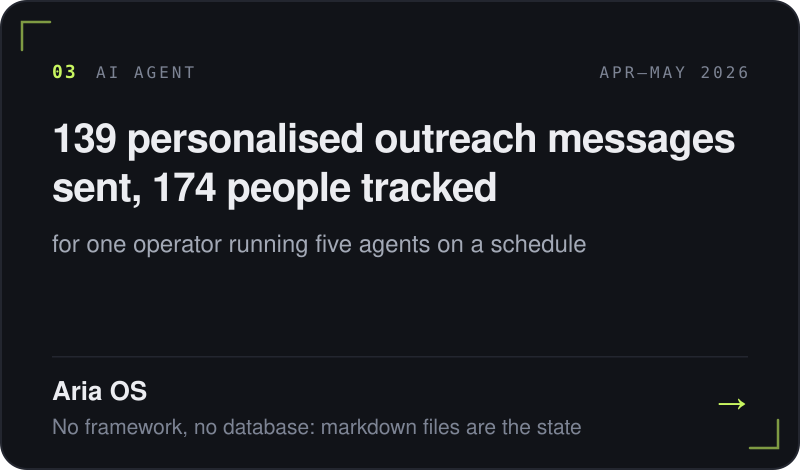
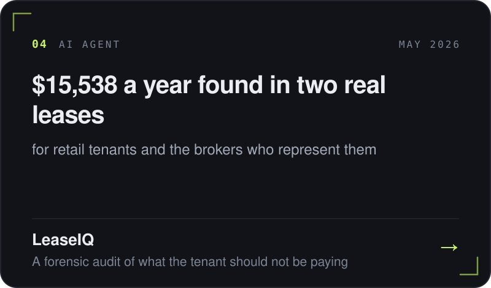
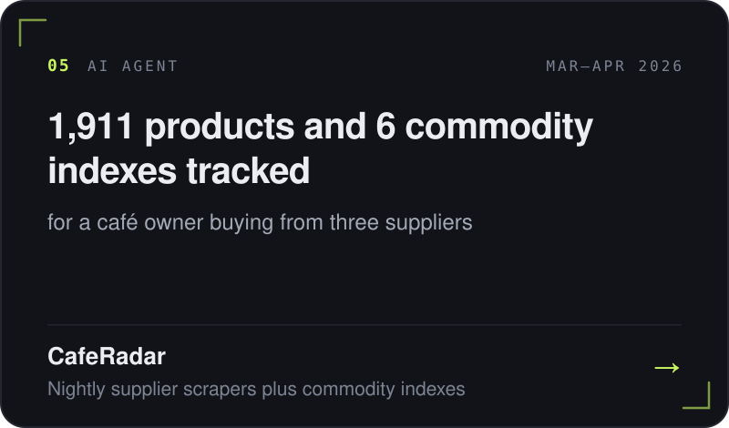
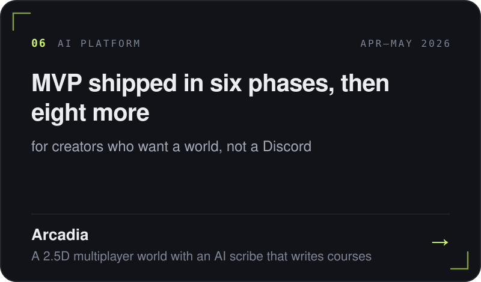

 
 

**[ibiraheel.com](https://ibiraheel.com)** &nbsp;&nbsp;·&nbsp;&nbsp; [LinkedIn](https://www.linkedin.com/in/muhammad-i-raheel/) &nbsp;&nbsp;·&nbsp;&nbsp; [ir336@drexel.edu](mailto:ir336@drexel.edu)

 

## Featured work

## Also built

**Voice agents**
- [SG CPA voice receptionist](https://github.com/ibi-raheel/sg-receptionist): after-hours calls answered, zero hallucinated answers
- [Luno](https://github.com/ibi-raheel/luno): a full voice loop on an ESP32-S3
- [Plushie](https://github.com/ibi-raheel/plushie): a plushie that talks back

**Agents**
- [Parcel Scout](https://github.com/ibi-raheel/parcel-scout): 8 data sources, 4 counties, one ownership graph
- [Drexel ELO Recommender](https://github.com/ibi-raheel/elo-recommender): 2,429 opportunities crawled and classified

**Products**
- [Alchemist Pharmacy](https://github.com/ibi-raheel/alchemist-pharmacy): 300 to 545 orders a month
- [Freightly CRM](https://github.com/ibi-raheel/unisole-crm): a dispatch business moved from spreadsheets to a live CRM
- [Alchemist customer database](https://github.com/ibi-raheel/alchemist-customer-db): loyalty points pooled across five branches
- [Ahbab feasibility builder](https://github.com/ibi-raheel/ahbab-feasibility-dashboard): reproduces a feasibility study to the rupee
- [One Rainy Day](https://github.com/ibi-raheel/One-rainy-day): café cost per serving, recalculated live
- Sites for [UniSole Logistics](https://github.com/ibi-raheel/unisole-logistics) and [Mashal AI Academy](https://github.com/ibi-raheel/mashal-website)

## Recognition

- **GalaxyGate track winner**, Coffee & Code AI Agent Hackathon, Philadelphia 2026
- **Comcast AI Award and Runner-Up**, Philly Codefest 2026
- **Top 15 in North America**, Global Student Entrepreneur Awards; 2026 Philadelphia champion
- **1st of 100+ teams**, Baiada Institute Innovation Tournament, Drexel 2026
- **Campus winner**, Hult Prize Drexel 2026
- **Top 300 of 50,000**, AWS 10,000 AIdeas

## Stack

Claude · Claude Code · OpenAI · Gemini · MCP · Python · TypeScript · Next.js · FastAPI · Supabase · Postgres · Twilio · ElevenLabs · AWS Bedrock · ESP32 · Vercel

 

Open to AI product and engineering roles

