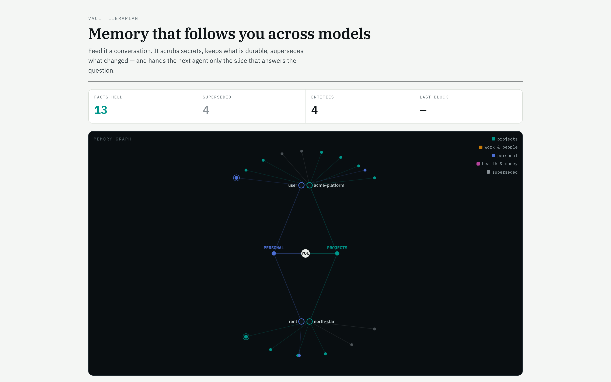
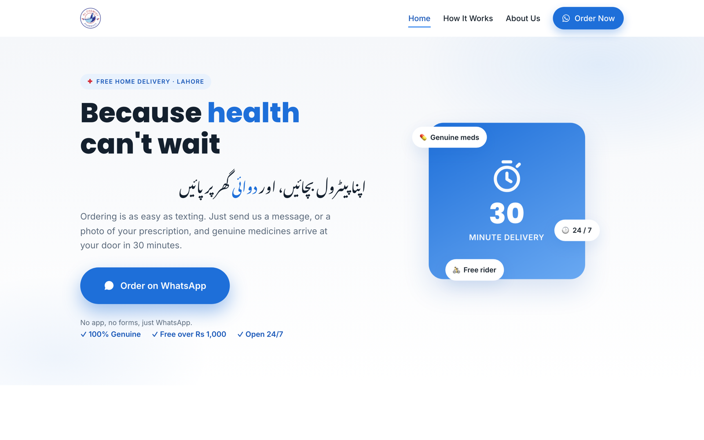
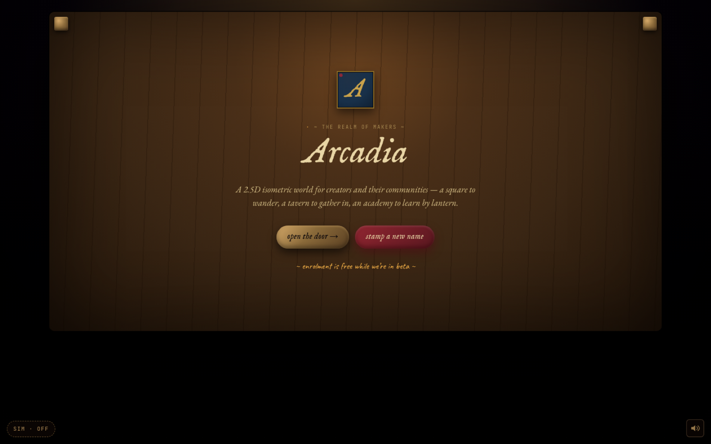

# Muhammad Ibrahim Raheel

**I build AI agents that do real work.** 
Voice agents that answer real phones · autonomous systems that run on a schedule · products built end to end with agentic workflows.

**16 AI agents shipped** · **6× hackathon winner** · Founder, [Slate CRE](https://www.slatecre.co) · Drexel University, Dec 2026

 

## Featured

Every project leads with what it did, not what it's made of.

<table>
<tr>
<td width="50%" valign="top">

<h3><a href="https://github.com/ibi-raheel/vault">Vault Librarian</a></h3>
<b>GalaxyGate Track winner: 2,746 messages in, 94 tokens out.</b> 
Memory that follows you across every model and agent, with supersession instead of duplication. Built with a team of three at Coffee &amp; Code.
</td>
<td width="50%" valign="top">

<h3><a href="https://github.com/ibi-raheel/alchemist-pharmacy">Alchemist Pharmacy</a></h3>
<b>300 to 545 orders a month (+82%).</b> 
A 5-branch pharmacy's ordering rebuilt around a WhatsApp AI agent that takes 100% of order intake.
</td>
</tr>
<tr>
<td width="50%" valign="top">

<h3><a href="https://github.com/ibi-raheel/arcadia">Arcadia</a></h3>
<b>MVP shipped in six phases, then eight more.</b> 
A 2.5D isometric world for creator communities, with a Gemini course-maker that turns uploaded material into lessons.
</td>
<td width="50%" valign="top">

<h3><a href="https://github.com/ibi-raheel/aria-os">Aria OS</a></h3>
<b>139 personalised outreach messages sent, 174 people tracked.</b> 
Five autonomous agents on a schedule. No framework, no database: markdown files are the state.
</td>
</tr>
<tr>
<td width="50%" valign="top">

<h3><a href="https://github.com/ibi-raheel/caferadar">CafeRadar</a></h3>
<b>1,911 products and 6 commodity indexes tracked.</b> 
Nightly supplier scrapers plus FRED and BLS indexes that tell a café owner when to renegotiate.
</td>
<td width="50%" valign="top">

<h3><a href="https://github.com/ibi-raheel/elo-recommender">Drexel ELO Recommender</a></h3>
<b>2,429 opportunities crawled and classified.</b> 
Crawls Drexel, classifies experiential-learning opportunities, and recommends a path from a short assessment.
</td>
</tr>
</table>

## Voice agents

| | What it did | Built with |
|---|---|---|
| [**Emotion-aware AI dispatcher**](https://github.com/ibi-raheel/ai-receptionist-v2) | Every call answered, every lead captured, with a live emotion engine and a conversation state machine | Twilio · Deepgram · OpenAI · ElevenLabs |
| [**SG CPA voice receptionist**](https://github.com/ibi-raheel/sg-receptionist) | After-hours calls answered, zero hallucinated answers | Claude · Twilio · ElevenLabs · FastAPI |
| [**Luno**](https://github.com/ibi-raheel/luno) | A full voice loop on an ESP32-S3: mic to Whisper to reply to speaker | ESP32-S3 · WebSockets · Whisper · ElevenLabs |
| [**Plushie**](https://github.com/ibi-raheel/plushie) | A plushie that talks back | ESP32 · Flask · Whisper · GPT |

Hear the calls, turn by turn, at **[ibiraheel.com](https://ibiraheel.com)**.

## More agents and products

- [**LeaseIQ**](https://github.com/ibi-raheel/leaseiq): $15,538 a year in overcharges found across two real retail leases, every finding quoting the lease verbatim.
- [**Parcel Scout**](https://github.com/ibi-raheel/parcel-scout): 8 data sources, 4 counties, one ownership graph for off-market parcels in North Texas.
- [**Freightly CRM**](https://github.com/ibi-raheel/unisole-crm): a dispatch business moved from spreadsheets to a live CRM.
- [**Alchemist customer database**](https://github.com/ibi-raheel/alchemist-customer-db): a purchase captured in seconds, loyalty points pooled across five branches.
- [**Ahbab feasibility builder**](https://github.com/ibi-raheel/ahbab-feasibility-dashboard): reproduces a feasibility study to the rupee.
- [**One Rainy Day**](https://github.com/ibi-raheel/One-rainy-day): cost per serving for a café, recalculated the moment an ingredient price moves.
- Sites: [UniSole Logistics](https://github.com/ibi-raheel/unisole-logistics) · [Mashal AI Academy](https://github.com/ibi-raheel/mashal-website)

## Recognition

- **Coffee & Code AI Agent Hackathon, Philadelphia 2026:** GalaxyGate track winner (Vault Librarian)
- **Philly Codefest 2026:** Comcast AI Award across 97 submissions, and Runner-Up, Advanced Category (MAYDAY dispatch)
- **Global Student Entrepreneur Awards (EO):** Top 15 student entrepreneurs in North America; 2026 Philadelphia champion
- **Baiada Institute Innovation Tournament:** 1st place of 100+ teams, Drexel University, April 2026
- **Hult Prize:** Drexel campus winner, 2026
- **AWS 10,000 AIdeas:** top 300 of 50,000 applicants

## Tools I reach for

---

Open to AI product and engineering roles · <a href="https://ibiraheel.com">ibiraheel.com</a>

